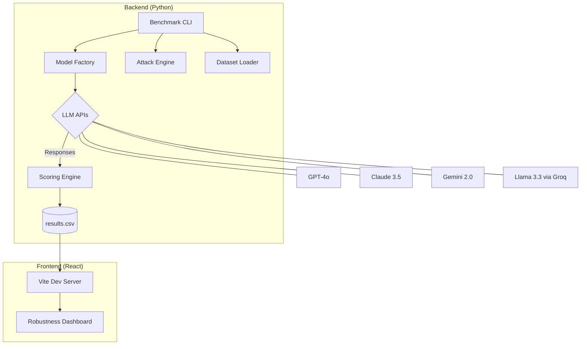

# Multi-LLM Prompt Robustness Benchmark (PRB)

[](https://www.python.org/)
[](https://reactjs.org/)

A professional framework for evaluating the adversarial robustness of Large Language Models. This system measures how significantly accuracy drops when prompts are subjected to character-level, word-level, and sentence-level perturbations.

---

## 🏗️ System Architecture

The project follows a decoupled architecture separating the heavy benchmarking logic from the visualization dashboard.



---

## 🚀 Key Features

*   **Dual-Mode Evaluation**:
    *   **Benchmark Mode**: Automated testing across **SST-2**, **MMLU**, and **GSM8K** datasets.
    *   **Custom Mode**: Interactive sandbox to test your own prompts against adversarial variations.
*   **Adversarial Attack Suite**: Implements research-standard perturbations including **TextBugger**, **DeepWordBug**, and **TextFooler**.
*   **Multi-Provider Support**: Built-in wrappers for OpenAI, Anthropic, Google Gemini, and Groq (Llama/Mistral).
*   **Professional Dashboard**: A terminal-aesthetic React UI for real-time tracking of robustness metrics and model rankings.

---

## 🛠️ Installation & Setup

### 1. Backend Setup
```bash
# Install Python dependencies
pip install -r requirements.txt

# Configure environment variables
cp .env.example .env
# Add your API keys to .env
```

### 2. Frontend Setup
```bash
cd frontend
npm install
npm run dev
```

---

## 📊 Methodology

### Adversarial Attacks
We evaluate model resilience using five distinct perturbation strategies:
1.  **TextBugger**: Injects typos using character swaps, insertions, and deletions.
2.  **DeepWordBug**: Targets high-importance tokens with character-level bugs.
3.  **TextFooler**: Replaces tokens with semantically similar synonyms (WordNet).
4.  **CheckList**: Appends irrelevant distracting sentences to test attention.
5.  **StressTest**: Appends repeated filler text to evaluate context length handling.

### Metrics
*   **Clean Accuracy**: Baseline performance on original prompts.
*   **Attacked Accuracy**: Performance under adversarial conditions.
*   **Robustness Score**: A ratio calculation `(Attacked Acc / Clean Acc)` representing the model's "resilience" to noise.

---

## 📈 Usage

### Run Automated Benchmark
```bash
python main.py --mode benchmark --samples 10
```

### Run Interactive Sandbox
```bash
python main.py --mode custom
```

### View Results
Open the dashboard at `http://localhost:5173` to see the live rankings and robustness heatmaps.

---

## 📜 License
MIT License. Created for LLM Robustness Research.
